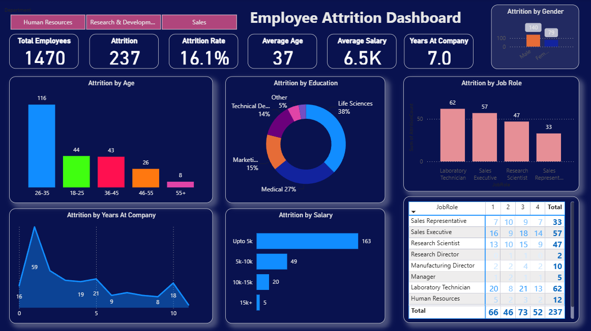

# Employee Attrition Analysis and Prediction

## 📌 Project Overview

This project analyzes employee attrition using Exploratory Data Analysis (EDA), Machine Learning, and Power BI. The objective is to identify key factors influencing employee turnover, predict employee attrition, and provide actionable insights for HR decision-making.

## 🎯 Objectives

- Analyze employee attrition patterns
- Identify factors influencing employee turnover
- Perform data cleaning and exploratory data analysis
- Build classification models to predict employee attrition
- Compare model performance
- Develop an interactive HR dashboard with key performance indicators
- Provide business recommendations for improving employee retention

## 📂 Dataset

**IBM HR Analytics Employee Attrition & Performance Dataset**

- Records: **1,470**
- Features: **35**
- Target Variable: **Attrition**

The dataset contains employee information such as age, department, job role, monthly income, job satisfaction, overtime, business travel, and other workforce-related attributes.

## 🛠️ Technologies Used

- Python
- Pandas
- NumPy
- Matplotlib
- Seaborn
- Scikit-learn
- Power BI
- Google Colab
- Jupyter Notebook

## 📊 Project Workflow

1. Data Collection
2. Data Inspection
3. Data Cleaning
4. Exploratory Data Analysis
5. Feature Engineering
6. Data Preprocessing
7. Classification Model Development
8. Model Evaluation
9. Feature Importance Analysis
10. Power BI Dashboard Development
11. Business Recommendations

## 🔍 Exploratory Data Analysis

The analysis examines relationships between employee attrition and factors including:

- Age
- Gender
- Department
- Job Role
- Monthly Income
- Overtime
- Job Satisfaction
- Business Travel
- Employee-related numerical attributes

## 🤖 Machine Learning

The following classification models were developed:

- Logistic Regression
- Decision Tree Classifier
- Random Forest Classifier

### Evaluation Metrics

Models were evaluated using:

- Accuracy
- Precision
- Recall
- F1-Score
- Confusion Matrix

Random Forest was also used to identify the most important features associated with employee attrition.

## 📊 Power BI HR Dashboard

An interactive Power BI dashboard was developed to help HR teams monitor employee attrition and workforce trends.

### Dashboard KPIs

- Total Employees
- Employees Left
- Attrition Rate
- Average Age
- Average Monthly Income

### Dashboard Analysis

- Attrition by Department
- Attrition by Gender
- Attrition by Job Role
- Attrition by Overtime
- Job Satisfaction
- Business Travel
- Interactive HR filters

### Dashboard Preview



## 💡 Key Business Insights

- Employees working overtime show higher attrition.
- Lower monthly income is associated with higher employee turnover.
- Job satisfaction is an important factor in employee retention.
- Attrition varies across departments and job roles.
- Employees with frequent business travel show higher turnover.
- Feature importance analysis helps identify the factors most relevant to predicting attrition.

## 💼 Business Recommendations

- Reduce excessive overtime and improve work-life balance.
- Review compensation strategies for lower-income employees.
- Improve employee engagement and job satisfaction.
- Develop targeted retention strategies for high-risk job roles.
- Monitor departments and employee groups with higher attrition rates.
- Use predictive analytics to identify employees who may be at higher risk of leaving.

## 📁 Repository Structure

```text
employee-attrition-analysis/
│
├── Employee_Attrition_Analysis.ipynb
├── Employee_Attrition_HR_Dashboard.png
├── WA_Fn-UseC_-HR-Employee-Attrition.csv
├── requirements.txt
├── README.md
├── LICENSE
└── .gitignore
```

## 🚀 Future Improvements

- Hyperparameter tuning
- Cross-validation
- XGBoost implementation
- Model explainability using SHAP
- Automated employee attrition monitoring
- Deployment of the prediction model as a web application

## 👩‍💻 Author

**Reshma Gurrala**
